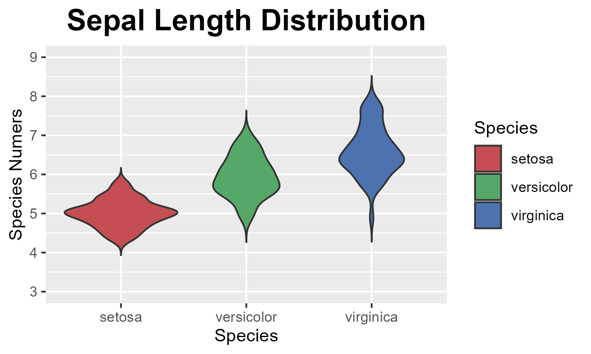

绘图代码如下

```R
library(ggplot2) 
data(iris)
p <- ggplot(iris,aes(x=Species,y=Sepal.Length,fill=Species))+
    geom_violin(trim = FALSE)+
    scale_fill_manual(values = c("#C44E52", "#55A868", "#4C72B0")) +
    scale_y_continuous(name = "Species Numers", limits = c(3,9), breaks = seq(3,9, by = 1))+
    labs(title="Sepal Length Distribution")+
    theme(
        plot.title = element_text(hjust = 0.5 ,size = 18, face = "bold")
    )
    
ggsave("iris.png", plot = p, height = 3, width = 5)

```

得到的图像为：
