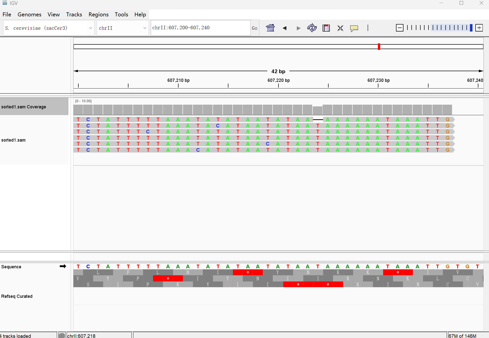

## 1 Part III. 1 Mapping 

1. 
一、提升运算速度
1. 反向搜索
   BWT生成的压缩字符串结合**FM-index**（Ferragina-Manzini索引），允许通过反向搜索快速定位查询序列的位置。其时间复杂度为**O(m)**（m为查询序列长度），远低于传统方法的线性扫描或哈希表的碰撞处理，显著加速比对过程。

2. 局部重复模式的聚类
   BWT会将重复的子串（如基因组中的保守区域）聚类为连续字符块。这使得比对时可通过跳跃式比对快速跳过无关区域，减少冗余比较。

3. FM-index的Rank/Select操作
   借助**Rank操作**（统计某字符在特定位置前的出现次数）和**Select操作**（定位某字符的第n次出现位置），FM-index能在常数时间内完成区间定位，无需遍历全基因组，极大提升搜索效率。

二、内存优化策略
1. 稀疏化后缀数组（Sampled Suffix Array）
   传统后缀数组需存储每个位置的指针（占O(n log n)空间，n为参考序列长度），而Bowtie仅保存**间隔采样**的后缀数组节点（如每32个位置存一个），其余节点通过BWT和FM-index动态计算恢复，大幅降低内存占用。

2. 压缩BWT及辅助数据结构 
   BWT转换后的字符串天然具有高压缩性（如长重复片段变为单一字符），且进一步采用**huffman编码**（如基因组仅含A/T/C/G/N）压缩存储BWT字符串。

3. 分块处理与按需加载  
   BWT将参考基因组的索引划分为多个区块，仅在比对时加载相关区块到内存，避免一次性载入全基因组索引。

2. 比对结果如下

```bash
file=THA2.sam
grep -v '^@' $file | awk '$3 != "*" {print $3}' | sort | uniq -c | sort -k1,1n

     12 chrmt
     15 chrIII
     17 chrVI
     18 chrI
     25 chrIX
     33 chrV
     51 chrII
     56 chrXI
     58 chrXIV
     67 chrXIII
     68 chrVIII
     71 chrX
     78 chrXVI
    101 chrXV
    125 chrVII
    169 chrXII
    194 chrIV
```

3. 

3.1
CIGAR string 是 SAM/BAM 文件中描述 read 和参考序列比对细节的字符串。它用一系列“数字+字母”组合来说明比对时发生的各种操作，比如：

- **M**：匹配或不匹配
- **I**：read 中的插入
- **D**：缺失
- **N**：跳过
- **S**：soft clipping，即 read 的一部分被剪掉但仍保留在记录中
- **H**：hard clipping，即 read 的一部分被剪掉且不在记录中
- **P**：填充
- **=** 和 **X**：分别表示精确匹配和错配

3.2 
“Soft clip”指的是在比对过程中，read 的某一部分没有用于比对（通常是因为这部分质量较低或存在较大差异），但这些碱基信息仍保留在 SAM 文件的记录中。它在 CIGAR string 中用字母 **S** 表示。例如，`5S95M` 表示 read 的前 5 个碱基被 soft clip，而接下来的 95 个碱基用于比对。

3.3 
Mapping quality（MAPQ）是一个数值，通常存储在 SAM/BAM 文件的第5列，用来反映该 read 比对到参考序列位置的可信度。其主要含义包括：
- **比对唯一性**：高 MAPQ 值通常意味着该 read 在参考基因组上只有一个最佳匹配位置，而低 MAPQ 值可能表示存在多个候选比对位置。
- **比对准确性**：MAPQ 值也反映了比对算法对当前比对结果的信心程度。较高的数值代表比对结果更可靠。

不同的比对工具对 MAPQ 的计算方法可能有所不同，但总体来说，MAPQ 越高，代表比对的准确性和唯一性越高。

3.4 
仅凭 SAM/BAM 文件中标准的比对字段（如 CIGAR string、比对位置等）通常无法直接还原出完整的参考基因组序列，因为这些信息只描述了比对的方式和位置，而不包含参考序列本身。
但是如果 SAM/BAM 文件中包含 **MD tag**，则可以获得额外信息。MD tag 记录了比对过程中参考序列与 read 不匹配的碱基信息（例如错配或缺失）。结合 CIGAR string 和 MD tag，在理论上可以重构出比对区域参考序列的部分信息。仅依靠 SAM/BAM 文件（包含 MD tag 的情况下）可以在一定程度上推断出比对区域对应的参考序列的差异信息，但不能完整恢复整个参考序列。获取完整的参考序列还是需要依赖于对应的参考基因组数据。

4. 
在`git clone`远程仓库到本地，并将需要的文件粘贴到当前目录下后，使用脚本如下
```bash
exe=./bwa
index=./sacCer3.fa
tar=THA2.fa

# renew all
make clean
make

$exe index $index

# mapping
$exe mem $index $tar > THA2.sam

grep -v '^@' THA2.sam | awk '$3 != "*" {print $0}' | sort -k 3 -k 4n > THA2.sort.sam
```
得到的结果和`bwt`得到的结果类似。

## 2 Part III. 1.1 Genome Browser

根据`sam`文件，将不同的`reads`比对到酵母的基因组上。由于文件提供的`reads`特别低，所以比对后得到的图像几乎未显示任何`color bar`，因此选择根据文件的内容进行定位，寻找到比对结果如下：

