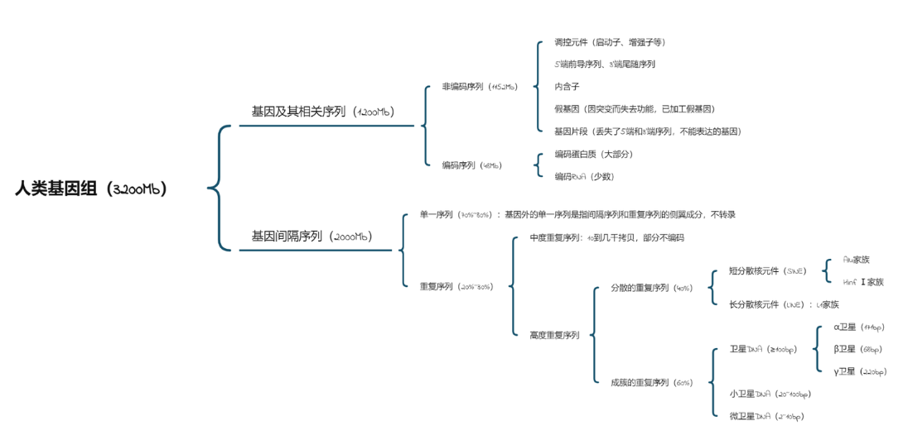
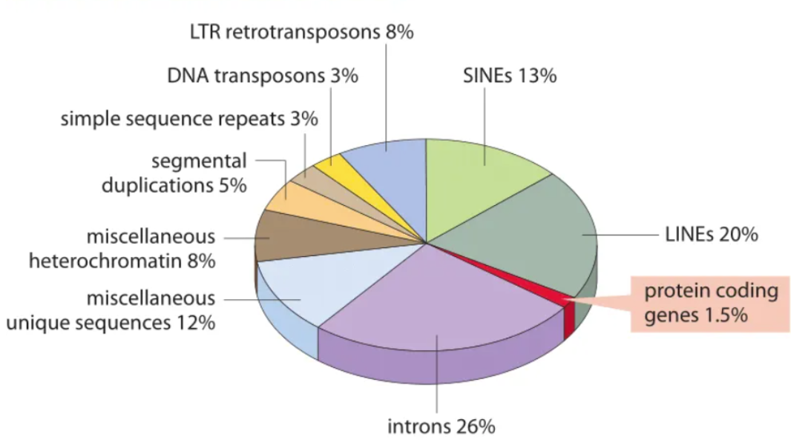

##  Part III. 1.2 bedtools/samtools 

1. 执行分析结果如下
```bash
samtools flagstat COAD.ACTB.bam 
# 下面为输出
185650 + 0 in total (QC-passed reads + QC-failed reads)
4923 + 0 secondary
0 + 0 supplementary
0 + 0 duplicates
185650 + 0 mapped (100.00% : N/A)
0 + 0 paired in sequencing
0 + 0 read1
0 + 0 read2
0 + 0 properly paired (N/A : N/A)
0 + 0 with itself and mate mapped
0 + 0 singletons (N/A : N/A)
0 + 0 with mate mapped to a different chr
0 + 0 with mate mapped to a different chr (mapQ>=5)
```
根据输出结果, `paired in sequencing`数量为0，所以为单端测序分析。

2. `Secondary alignment`是指次要比对信息。对于一条比对到多个位置的`read`，该条记录为次优比对，在双端测序中，代表`hardclip`.
```bash
# 统计 secondary alignment 的数量
samtools view -f 0x100 COAD.ACTB.bam | wc -l
# 输出
4923
```

3. 使用脚本如下
```bash
file1="hg38.ACTB.gff"
file2="COAD.ACTB.bam"

# 筛选gene
awk '$3 == "gene" {print $1 "\t" ($4-1) "\t" $5 "\t" $9}' ${file1} > gene.bed

# 筛选exon
awk '$3 == "exon" {print $1 "\t" ($4-1) "\t" $5 "\t" $9}' ${file1} > exon.bed

# 比对gene和exon
bedtools subtract -a gene.bed -b exon.bed > intron.bed

# 从bam文件中提取比对结果
bedtools intersect -abam ${file2} -b intron.bed > CoAD.ACTB.intron.bam

# 转化
bedtools bamtofastq -i CoAD.ACTB.intron.bam -fq CoAD.ACTB.intron.fastq
```

4. 脚本如下
```bash
samtools sort COAD.ACTB.bam > COAD.ACTB.sorted.bam
samtools index COAD.ACTB.sorted.bam
bedtools genomecov -split -ibam COAD.ACTB.sorted.bam -bg >  COAD.ACTB.coverage.bedgraph
```

## PPT题目

1. 人类基因组大概有`30`亿对碱基，其中大约有`1.5%`也即`2~3`万个可编码蛋白的基因。平均基因的长度为`10kb`，不同的基因长度相差很大，剩下`98.5%`均为非编码区域，包括各种调控基因表达的`DNA`原件，同时也可以转录为`non-coding RNA`，发挥潜在作用。
关于基因组内部的分类，不同的分类标准会带来不同的结果。根据编码和非编码区域来分，可以得到下列结果。




> 数据来源：
> 1. [Li's Bioinfo-Blog](https://lishensuo.github.io/)
> 2. [International Human Genome Sequencing Consortium. Initial sequencing and analysis of the human genome.](https://doi.org/10.1038/35057062) Nature 409, 860–921 (2001).

2. 

i. 非编码RNA的最新注释数量
根据**GENCODE（人类基因组注释项目）最新版（v44，2023年）**：已注释的非编码RNA基因数量约10万~12万条，具体包括多种亚型（如长链非编码RNA、小核RNA等）。

ii. 非编码RNA的主要分类及数目

| **非编码RNA类型**          | **注释数量** | **功能简述**                                                                 |
|-------------------------------|----------------------|----------------------------------------------------------------------------|
| **长链非编码RNA (lncRNA)**   | >50,000             | 调控染色质结构、基因表达和表观遗传学过程。                                |
| **微小RNA (miRNA)**         | ~2,500              | 通过结合mRNA抑制翻译或降解靶标，调控基因表达。                           |
| **核仁小RNA (snoRNA)**      | ~1,800              | 指导rRNA化学修饰（如2’-O-甲基化和假尿苷化）。                          |
| **小干扰RNA (siRNA)**        | ~1,200              | 介导RNA干扰（RNAi），沉默特定mRNA。                                     |
| **PIWI蛋白互作RNA (piRNA)** | ~30,000            | 维持生殖细胞基因组稳定性，转座子沉默。                                  |
| **核糖体RNA (rRNA)**         | ~400                | 核糖体的结构核心，催化蛋白质合成。                                      |
| **转运RNA (tRNA)**           | ~500                | 携带氨基酸至核糖体，参与蛋白质合成。                                    |


iii. 一些主要非编码RNA的功能解析

(1) 长链非编码RNA（Long non-coding RNA, lncRNA）
通过招募染色质修饰复合物，调控基因组的空间构象和表观遗传状态（如X染色体失活）。

(2) miRNA（微小RNA）
通过与靶标mRNA的3'UTR碱基配对，诱导翻译抑制或mRNA降解，广泛参与发育和疾病进程。

(3) PIWI-interacting RNA (piRNA)
在生殖细胞中沉默转座元件，保护基因组完整性，防止基因突变。

(4) snoRNA（核仁小RNA）
指导rRNA的化学修饰（如甲基化和假尿苷酸化），确保核糖体正常组装。


iv. 参考数据库
> - **GENCODE**（https://www.gencodegenes.org）
> - **LNCipedia** (https://lncipedia.org)
> - **NONCODE** (http://www.noncode.org/)
