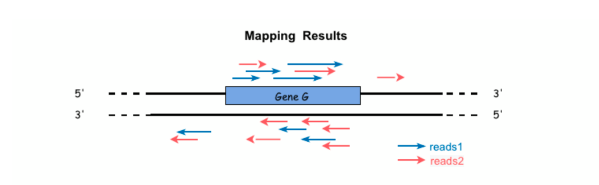
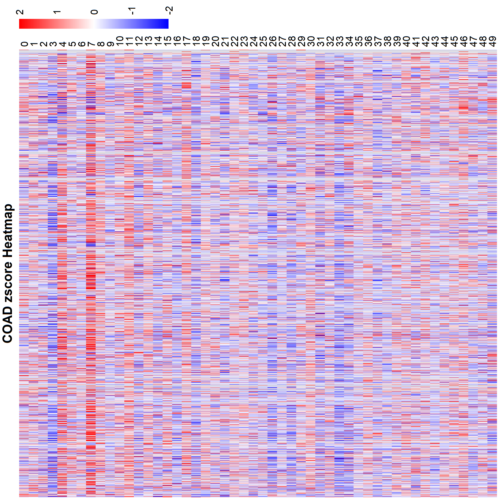
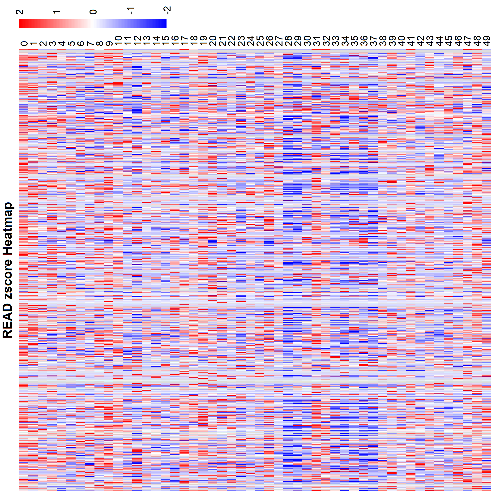
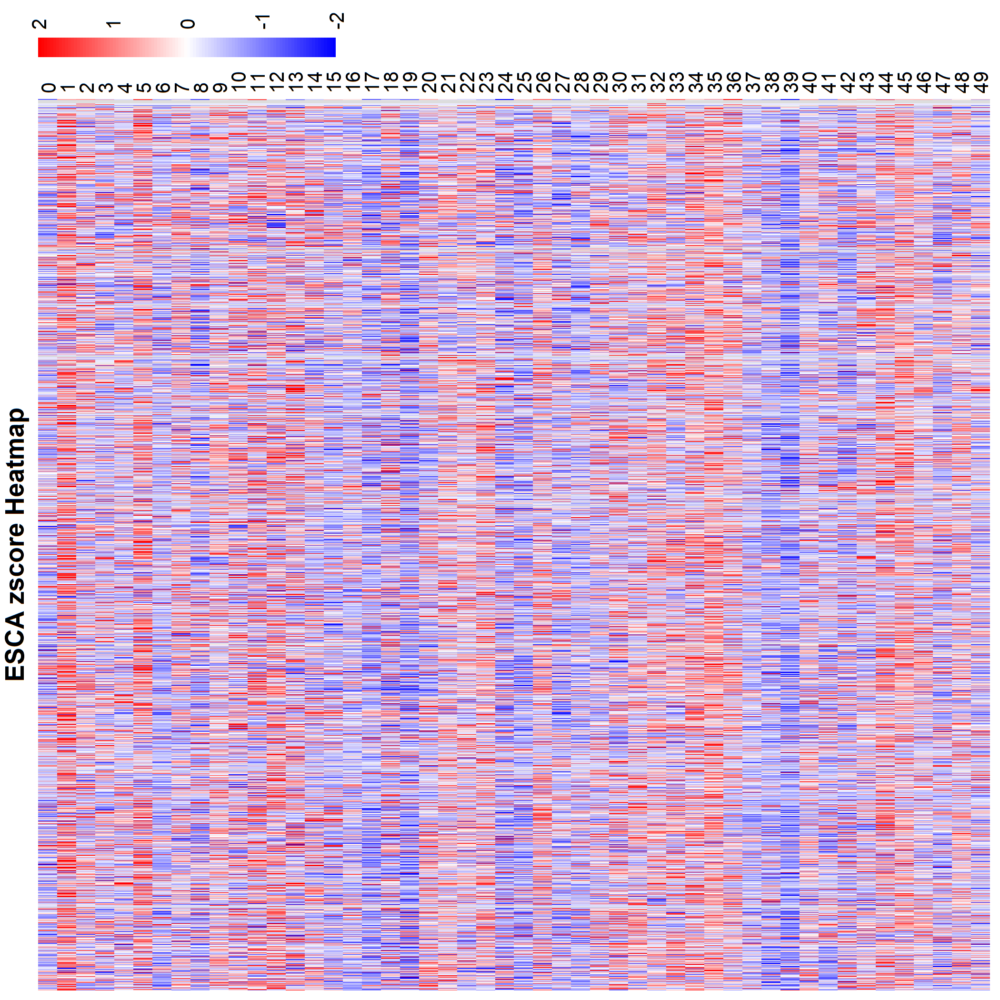
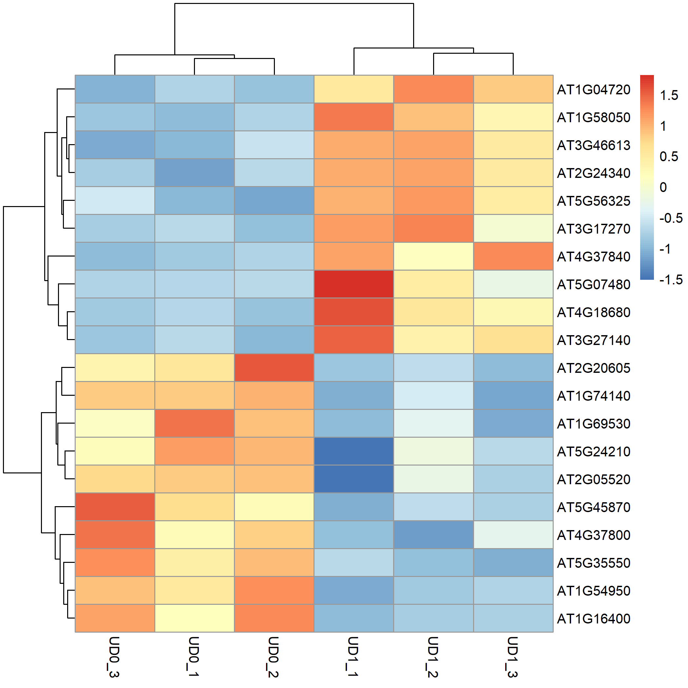

## Part III. 2.1 RNA-seq - Expression Matrix

1. 以下是RNA-seq中归一化基因表达值的几种基本计算方法及其说明：

---
i. Median Normalization

算法步骤: 
> 1. 计算样本中位数
对每个样本的所有基因表达值排序，取中位数 ( M_i )

> 2. 确定基准
全局中位数：所有样本中位数的中位数。以此位全局中位数

> 3. 计算缩放因子（Scaling Factor, SF）
$ SF_i = \frac{M_i}{M_{\text{ref}}} $
$( M_i )$：样本i的表达值中位数。
$( M_{\text{ref}} )$：参考基准（如全局或对照组中位数）。

> 4. 标准化表达式值
$X'{ij} = \frac{X{ij}}{SF_i}$
$( X_{ij} )$：原始表达值。
$( X'_{ij} )$：标准化后的表达值

ii. RPM/CPM (Reads/Counst Per Million)

算法公式:  
> $ \text{RPM} = \frac{\text{基因的reads数}}{\text{总reads数}} \times 10^{-6} $

iii. RPKM/FPKM

算法公式:  
> $ \text{RPKM} = \frac{10^6 \times \text{reads数}}{\text{总reads数} \times \text{基因长度(kb)}} $

iv. TPM (Transcripts Per Million)

算法公式:  
> $ \text{TPM} = \frac{\text{RPKM}}{\sum_{i}\text{RPKM}_i} \times 10^6 $

v. DESeq标准化

> 计算方法：
计算几何均值：按行计算每个基因在所有样本中的几何均值, $G_i = \sqrt[n]{K_{i1} \cdot K_{i2} \cdots K_{in}}$
计算每个样本的比例因子：每个样本$(j)$中每个基因的比例为该基因的计数与其几何均值的比，$r_{ij} = \frac{K_{ij}}{G_i}$
样本的大小因子：每个样本的所有比例的中位数，$s_j = \text{median}{\frac{K_{ij}}{G_i}}_{i=1}^m$
标准化后的计数：原计数除以对应样本的大小因子，$K'{ij} = \frac{K{ij}}{s_j}$


vi. TMM (Trimmed Mean of M-values)
> 计算方法：
选定参考样本
计算每个基因在样本B与参考样本A的log比值，$M_i = \log_2 \frac{K_{ij}}{K_{iref}} $,  ($ K_{iref} $) 是参考样本的计数值
选定一定的比例，Trim掉最高和最低部分，例如前$30\%$的后$30\%$的分位数。
剩余log比值的平均数即为缩放因子


2. 根据下述图片描述，填出对应选项:



The mapping results of the raw reads we got as shown above。
- if the library preparation method is Standard illumina ,The actual raw counts of the Gene G is 13.
- if the library preparation method is Ligation method,The actual raw counts of the Gene G is 9.
- if the library preparation method isdUTPs method,The actual raw counts of the Gene G is 4.

3. 使用命令如下

```bash
/usr/local/bin/infer_experiment.py -r GTF/Arabidopsis_thaliana.TAIR10.34.bed -i bam/Shape01.bam
# 输出结果
Reading reference gene model GTF/Arabidopsis_thaliana.TAIR10.34.bed ... Done
Loading SAM/BAM file ...  Total 200000 usable reads were sampled


This is PairEnd Data
Fraction of reads failed to determine: 0.0315
Fraction of reads explained by "1++,1--,2+-,2-+": 0.4769
Fraction of reads explained by "1+-,1-+,2++,2--": 0.4916
# 根据结果，可以看出两个Faction的占比基本一致，可以认为为strand nonspecific测序

# 计算AT1G09530基因(PIF3基因)上的counts数目
grep "AT1G09530" result/Shape02.featurecounts.exon.txt | cut -f7
# 输出为86
```
4. 使用命令如下
```python
import os
import pandas as pd
import numpy as np
import matplotlib.pyplot as plt
file_path = r'tumor-transcriptome-demo'

# 合并每个数据集下的counts
for my_dir in os.listdir(file_path):
    gene_dict = {}
    for seq, my_file in enumerate(os.listdir(file_path + '/' + my_dir)):
        with open(file_path + '/' + my_dir + '/' + my_file) as f:
            for line in f:
                line = line.strip().split('\t')
                if len(line) != 7:
                    continue
                if line[0] == "Geneid":
                    continue

                if line[0] not in gene_dict:
                    gene_dict[line[0]] = [0 for _ in range(len(os.listdir(file_path + '/' + my_dir)))]
                    gene_dict[line[0]][seq] = int(line[6])
                else:
                    gene_dict[line[0]][seq] += int(line[6])

    df = pd.DataFrame.from_dict(gene_dict)
    df.to_csv(file_path + '/' + my_dir + '.csv', index=True)

# 进行归一化，并计算z-score
for my_dir in os.listdir(file_path):
    if not my_dir.endswith('.csv'):
        continue
    df = pd.read_csv(file_path + '/' + my_dir, index_col=0)
    head = df.columns
    matrix = df.values

    # 归一化
    matrix = matrix.T * 1e6 / matrix.sum(axis=1) 

    matrix = matrix.T
    matrix = np.log2(matrix + np.full(matrix.shape, 1))
    
    # 计算z-score
    mean = matrix.mean(axis=0)
    std = matrix.std(axis=0)
    matrix = (matrix - mean) / std

    df = pd.DataFrame(matrix, columns=head)
    df.to_csv(file_path + '/' + my_dir + '_zscore.csv', index=True)
```

```R
# 绘制热图
library(tidyverse)
library(pheatmap)

COAD_data <- read.csv("COAD.csv_zscore.csv",row.names = 1, check.names = FALSE)
COAD_clipped_data <- COAD_data %>% mutate_all(~pmin(pmax(.,-2),2))
my_color <- colorRampPalette(c("blue",'white',"red"))(100)
breaks <- seq(-2,2,length.out = 101)
pheatmap(as.matrix(COAD_clipped_data),
         color = my_color,
         breaks = breaks,
         show_rownames = TRUE,
         show_colnames = FALSE,
         cluster_rows = FALSE,
         cluster_cols = FALSE,
         border_color = NA,
         main = "COAD zscore Heatmap",
         filename = "COAD.png",
         )
```
绘制结果如下：






根据热图的结果，COAD和READ的是最相似的。

## Part III. 2.3 RNA-seq - Diff. Exp

1. 

`Multiple Test Correction`（多重检验校正） 是在进行多次假设检验时，为了控制错误发现率`FDR`或`FWER`而采用的一种统计方法。当同时进行多个假设检验时，不进行校正会导致错误拒绝原假设的概率显著增加，从而可能得出不正确的结论。多重检验校正通过调整统计量（如p值或q值）来降低这种风险。

p值是假设检验中用来衡量观测数据与原假设一致性的统计量。具体来说，p值是假设原假设为真时，观察到当前数据或更极端数据的概率。p值越小，拒绝原假设的证据越强。通常，p值小于0.05被认为是统计显著的。
但当进行多次假设检验时，p值无法直接控制错误发现率（FDR）。例如，在100次检验中，即使所有原假设都是真的，也会有约5次检验的p值小于0.05（假阳性）。

q值是一种经过多重检验校正后的统计量，用于控制错误发现率（FDR）。q值表示在拒绝某个假设时，错误拒绝的比例（即假阳性率）。
q值越小，控制错误发现率的能力越强。例如，q值小于0.05意味着在拒绝的所有假设中，大约5%可能是错误的。q值通过多重检验校正，能够有效地控制假阳性率，尤其适用于大规模数据分析（如基因表达分析、脑成像研究等）。

- p值 是单次假设检验中常用的统计量，但无法直接解决多重检验问题。
- q值 是经过多重检验校正后的统计量，能够有效地控制错误发现率（FDR），尤其适用于大规模数据分析。

2. 
i. DESeq标准化

> 计算方法：
计算几何均值：按行计算每个基因在所有样本中的几何均值, $G_i = \sqrt[n]{K_{i1} \cdot K_{i2} \cdots K_{in}}$
计算每个样本的比例因子：每个样本$(j)$中每个基因的比例为该基因的计数与其几何均值的比，$r_{ij} = \frac{K_{ij}}{G_i}$
样本的大小因子：每个样本的所有比例的中位数，$s_j = \text{median}{\frac{K_{ij}}{G_i}}_{i=1}^m$
标准化后的计数：原计数除以对应样本的大小因子，$K'{ij} = \frac{K{ij}}{s_j}$


ii. EdgeR

`EdgeR`默认使用`TMM`方法，对样本间的库大小做组合偏差校正。
> 计算方法：
选定参考样本
计算每个基因在样本B与参考样本A的log比值，$M_i = \log_2 \frac{K_{ij}}{K_{iref}} $,  ($ K_{iref} $) 是参考样本的计数值
选定一定的比例，Trim掉最高和最低部分，例如前$30\%$的后$30\%$的分位数。
根据M值计算加权平均 $ w_i = \frac{1}{Var(M_i)} $，进而计算出缩放因子，$ f_k = 2^{\frac {\sum {w_i * M_i}} {\sum{w_i}}} $.
最后根据缩放比例将原始库进行缩放即可，$ N_{k-diff} = N_k * f_k $

3. 
```R
# 执行下列脚本

raw.counts <- read.table("count_exon.txt", sep='\t', header = T,row.names = 1)
wt.raw.counts <- raw.counts[,c("UD1_1",	"UD1_2",	"UD1_3",	"UD0_1",	"UD0_2",	"UD0_3")]
wt.filtered.counts <- wt.raw.counts[rowMeans(wt.raw.counts) > 5, ]
conditions <- factor(c(rep("Control", 3), rep("Treatment", 3)),levels = c("Control","Treatment"))
colData <- data.frame(row.names = colnames(wt.filtered.counts),conditions=conditions)

library(DESeq2)
dds <- DESeqDataSetFromMatrix(wt.filtered.counts, colData, design = ~conditions)
dds <- DESeq(dds)
res <- results(dds)
write.table(res,"deqse.urt.light.vs.dark.txt", sep='\t', row.names = T, quote = F)
deseq.diff.table <- subset(res, padj < 0.05 & abs(log2FoldChange) > 1)
write.table(deseq.diff.table,"deqse.urt.light.vs.dark.filter.txt", sep='\t', row.names = T, quote = F)


conditions <- factor(c(rep("Control", 3), rep("Treatment", 3)),levels = c("Control","Treatment"))
design <- model.matrix(~conditions)

library(edgeR)
y <- DGEList(counts = wt.filtered.counts) 

y <- calcNormFactors(y, method="TMM")
y <- estimateDisp(y,design = design)
fit <- glmFit(y, design = design)

lrt <- glmLRT(fit,coef=2) 
diff.table <- topTags(lrt, n = nrow(y))$table
write.table(diff.table, file = 'edger.urt.light.vs.dark.txt', sep = "\t", quote = F, row.names = T, col.names = T)

edger.diff.table.filtered <- diff.table[abs(diff.table$logFC) > 1 & diff.table$FDR < 0.05,]
write.table(edger.diff.table.filtered, file = 'edger.urt.light.vs.dark.filter.txt', sep='\t', row.names = T, quote = F)

deseq.diff.table = rownames(deseq.diff.table)
edger.diff.table.filtered = rownames(edger.diff.table.filtered)


venn_list <- list(DESeq2 = deseq.diff.table, edgeR = edger.diff.table.filtered) 
library (VennDiagram) 
venn.diagram(
  x = venn_list,
  category.names = c("DESeq2" , "edgeR "),
  filename = 'venn.png',
  output=TRUE
)
```
结果在文件中
Venn图如下：


> 不知道为什么在vscode中打不开，在Windows资源管理器中能打开....

4. 
```R
# 执行脚本
library(edgeR)
library(pheatmap)
library(dplyr)

res <- read.table("edger.urt.light.vs.dark.filter.txt", header=TRUE, row.names=1, sep="\t", check.names=FALSE)
res$logFC <- as.numeric(res$logFC)

res_sorted <- res %>% arrange(desc(logFC))
top10_up <- head(rownames(res_sorted),10)
top10_down <- tail(rownames(res_sorted),10)
selected_genes <- c(top10_up, top10_down)

write.table(selected_genes, file="selected_top10_bottom10.txt", quote=FALSE, row.names=FALSE, col.names=FALSE)


raw.counts <- read.table("count_exon.txt", sep='\t', header = T,row.names = 1)
wt.raw.counts <- raw.counts[,c("UD1_1",	"UD1_2",	"UD1_3",	"UD0_1",	"UD0_2",	"UD0_3")]

dge <- DGEList(counts=wt.raw.counts)
dge <- calcNormFactors(dge)
cpm_mat <- cpm(dge, normalized.lib.sizes=TRUE)
log10_cpm <- log10(cpm_mat + 1)

zscore_mat <- t(scale(t(log10_cpm)))
zscore_mat[is.na(zscore_mat)] <- 0

present <- intersect(selected_genes, rownames(zscore_mat))
missing <- setdiff(selected_genes, rownames(zscore_mat))

mat20 <- zscore_mat[present, ]
pheatmap(mat20,
         cluster_rows   = TRUE,
         cluster_cols   = TRUE,
         show_rownames  = TRUE,
         show_colnames  = TRUE,
         filename       = "heatmap_top10_bottom10.pdf")

```

热图如下
