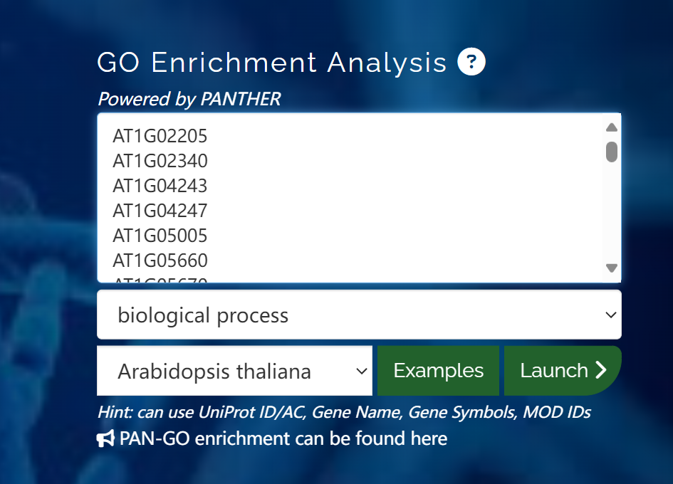
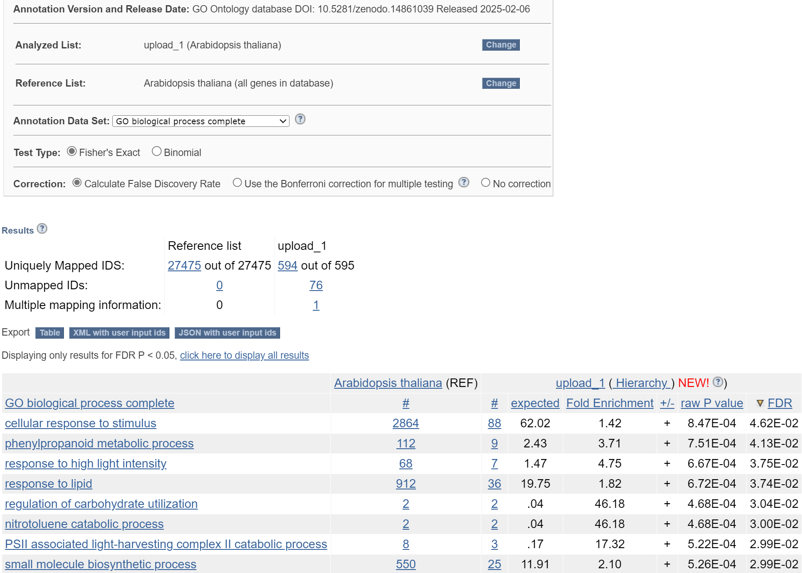
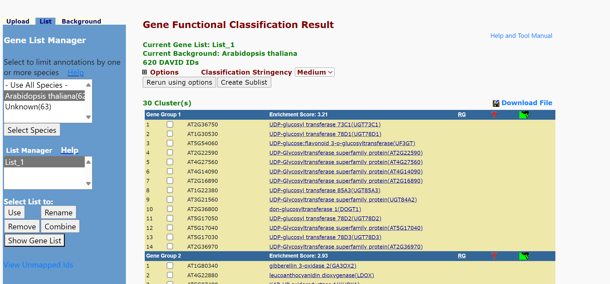
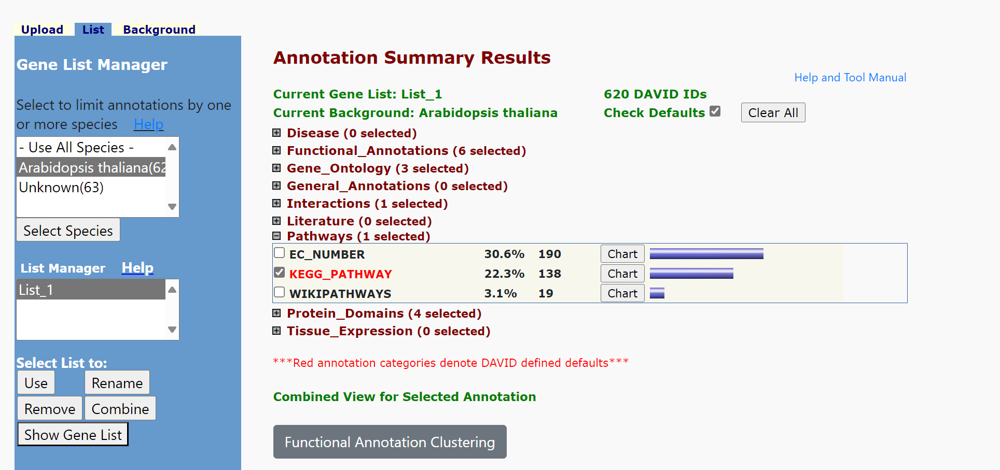
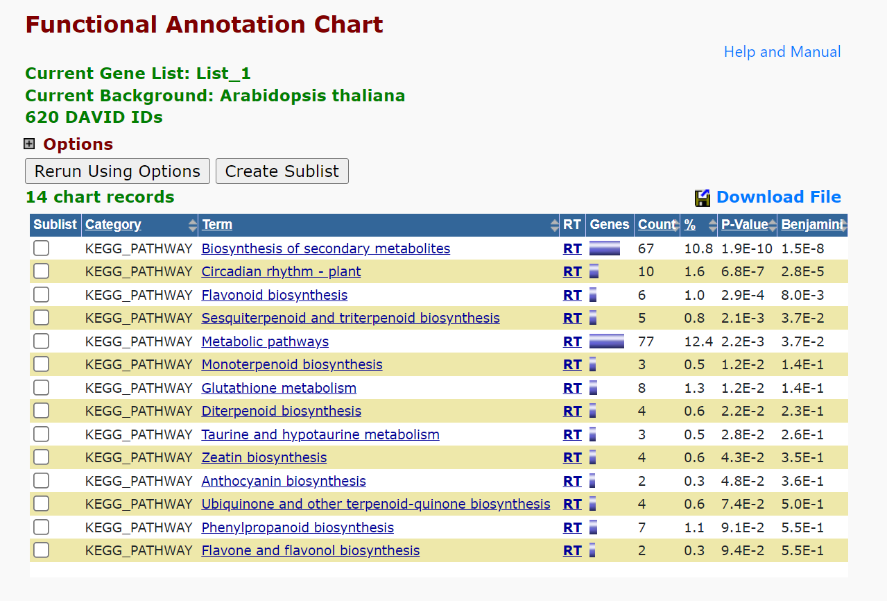

### Part II. 3.1  GO

1. 
分析步骤如下

i. 获取差异表达的基因`ID`
执行命令 `awk '(NR != 1){print $1}' wt.light.vs.dark.txt > gene.txt`，获得结果。

ii. 上传到`GO`数据库进行分析

结果表明，这部分基因和`cellular response to stimulus`部分显著相关，和实验处理的预期相一致。

2. 
i.`Fold Enrichment`计算

计算公式如下
$$
\mathrm{FE}
\;=\;
\frac{\displaystyle \frac{k}{K}}
     {\displaystyle \frac{M}{N}}
\;=\;
\frac{k\,N}{K\,M}
$$

其中，$N$ 为背景基因总数，$M$为背景中被标注到某 GO term 的基因数，$K$差异基因数，$k$为差异基因中被标注到该 GO term 的基因数。  
即：列表中该 term 基因的“实际频率”$k/K$，除以其在背景中的“期望频率”$M/N$。  

ii. P-value
检验在随机抽取 $K$ 个基因的情况下，恰好（或至少）出现 $k$ 个属于该 GO term 的基因的概率。假设背景中有 $M$ “标记”基因（属于该 term），随机抽取 $K$ 个，落入“标记”里 $X$ 个基因服从超几何分布。其单点概率：  
$$
P(X = i)
= \frac{\displaystyle \binom{M}{\,i\,}\,\binom{\,N-M\,}{\,K-i\,}}
       {\displaystyle \binom{N}{\,K\,}}\,. 
$$
我们通常关心“至少 $k$” 的累积概率作为富集的 P-value（单尾检验）：  
$$
\text{P-value}
= \sum_{i=k}^{\min(M,K)}
  \frac{\displaystyle \binom{M}{\,i\,}\,\binom{\,N-M\,}{\,K-i\,}}
         {\displaystyle \binom{N}{\,K\,}}\,
$$
如果这个值很小，就说明观察到的富集不太可能是随机造成的。

在 GO 分析中，上千个 GO terms 都要分别做一次超几何（或 Fisher）检验，就产生了大量的多重比较。若仅按原始 P-value\<0.05 来判定，会导致大量假阳性（false positives）。
因此，在定义“显著富集的 GO term”时，一般采用校正后的 q-value（即 FDR）\<0.05，而不是原始 P-value，以兼顾假阳性控制和统计检出率。

### Part II. 3.2  KEGG

1. 运行步骤如下图

富集结果如下

2. 和GO得到的结果的差异

i. 结果的共同点
  - 都检出“次级代谢”（secondary metabolism）相关：`GO` 中的 `phenylpropanoid、regulation of carbohydrate utilization` 与 `KEGG` 中的 `secondary metabolites、flavonoid、monoterpenoid、sesquiterpenoid` 等都指向植物通过合成次级代谢物来应对光照或环境变化。  
  - 都提示光/信号调控：`GO` 强调“对光/刺激的响应”（`cellular response to stimulus；response to high light intensity`），`KEGG` 则出现“昼夜节律—植物”（`circadian rhythm`），都反映光信号对 `uvr8` 突变体转录组的影响。

ii. 差异点
  - `GO` 偏向于分析功能模块，除了代谢，还涵盖细胞响应,碳水化合物利用调控,`PSII` 复合体降解等过程，侧重基因水平的生物学事件。  
  - `KEGG` 更聚焦于代谢通路,重点落在次级代谢物（黄酮、萜类、醌类）和核心代谢网络（`metabolic pathways`）、信号传导（`circadian rhythm`）。它把零散的基因集合整合到已知的代谢或信号通路模型中，便于解读具体代谢流或信号传导链。

iii. 二者之间的生物学差异
| 维度         | GO 富集                                   | KEGG 富集                                |
|------------|-----------------------------------------|----------------------------------------|
| 注释粒度      | 过程（process） vs. 分子功能 vs. 细胞组分             | 通路（pathway）                           |
| 结果可视化     | 可展开“层次结构”/网络，用 DAG 展示父子关系            | 通路图可以映射差异基因到具体酶或复合体           |
| 生物学解读     | 强调“做了什么”（响应、调控、降解……），关注功能多样性     | 强调“在哪里做”（哪个代谢通路、信号通路），关注代谢流或信号流 |   