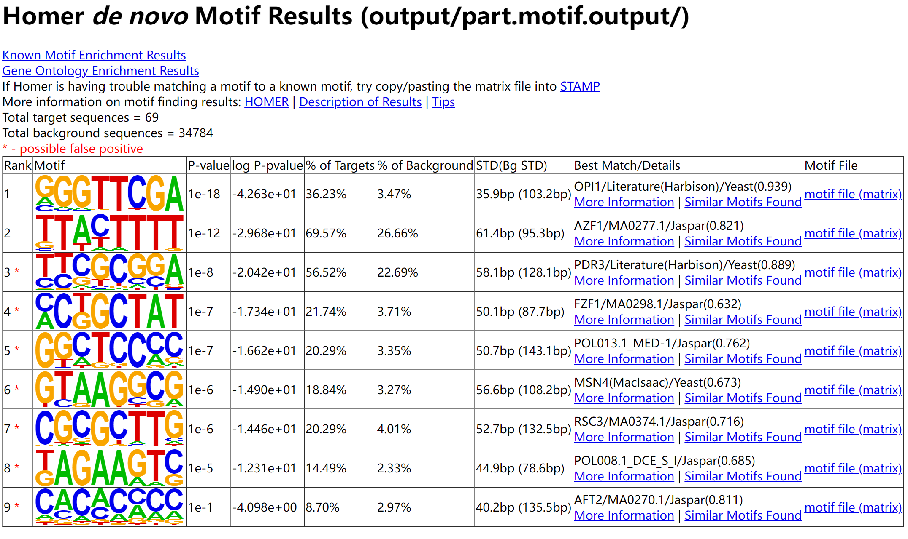

### Part III. 3 ChIP-seq

1. 
i. 去除非特异性背景噪音

ChIP-seq 会对染色质片段进行富集和测序，但实验过程中可能会出现很多非特异性结合（例如抗体不完全特异、DNA非特异性沉淀）。input 对照样本没有进行免疫共沉淀（没有用抗体富集），只是纯粹的染色质随机片段，它反映的是全基因组背景信号。通过比较 ChIP 样本和 input 样本，可以将非特异性或本底信号滤除，从而识别出真正的富集区域（peaks）。

ii. 校正染色质开放程度的偏差

染色质结构对 ChIP 效率有很大影响,开放的区域更容易被打断、片段化或富集，即使没有特异性结合，也可能表现出高信号。 input 样本可用于校正染色质的开放程度造成的测序偏差，避免误判为 TF 的结合位点。

iii. 提高 peak calling 准确性

在使用 MACS2、SICER 等软件进行 peak calling 时，input 样本可以作为统计学背景，从而更准确地估计本底噪音分布、提高富集区域识别的置信度以及控制假阳性。

2. 

i. `findPeaks`

| 参数         | 作用                                                                                                   |
| ---------- | ---------------------------------------------------------------------------------------------------- |
| `-style`   | 指定分析的类型，常见有：<br>• `factor`（转录因子，窄峰）<br>• `histone`（组蛋白修饰，宽峰）<br>• `super`（超级增强子）<br>• `dnase`（开放染色质） |
| `-o`       | 输出文件名（建议带上 `.txt` 后缀）                                                                                |
| `-i`       | 指定 input 对照样本目录，用于背景校正                                                                               |
| `-minDist` | 最小峰之间的距离（默认200bp）                                                                                    |
| `-size`    | 峰的窗口大小，例如 `-size 1000` 表示以1000bp为窗口识别峰                                                               |
| `-F`       | fold enrichment 值，比如 `-F 4` 表示信号要至少比 background 强 4 倍才算有效峰                                           |
| `-L`       | 最小 tag 数，只有超过这个 tag 数的区间才考虑为候选峰                                                                      |
| `-C`       | 过滤低复杂度区域或重复区域，例如 `-C 0.6` 表示不超过60%的 reads 来自重复区域                                                     |
| `-tbp`     | 限制每个位置最大 tag 数，常用于去除 PCR duplicates 的残留偏倚                                                            |


ii. `findMotifsGenome.pl`

| 参数                     | 作用                                                                          |
| ---------------------- | --------------------------------------------------------------------------- |
| `-size`                | motif 搜索区域大小，常用：<br>• `200`：以peak中心为中心，±100bp<br>• `given`：使用输入peak文件中给定的区域 |
| `-mask`                | 使用重复序列掩码（去除重复序列影响）                                                          |
| `-len`                 | 指定 motif 长度（可指定多个，如 `-len 8,10,12`）                                         |
| `-bg`                  | 指定背景区域文件，用于对比富集（默认会自动生成背景）                                                  |
| `-p`                   | 多线程加速（如 `-p 8` 表示使用8线程）                                                     |
| `-mknown` / `-mdenovo` | 是否只查找已知motif、只做de novo识别，默认都做                                               |

3. 
执行脚本生成`peak calling`和`motif finding`结果：
```bash
#!/bin/bash
mkdir output/
# 生成中间文件
makeTagDirectory ip    ip.chrom_part.bam
makeTagDirectory input input.chrom_part.bam

findPeaks ip/ -style factor -o output/part.peak -i input/
findMotifsGenome.pl output/part.peak sacCer2 output/part.motif.output -len 8
```

得到的`motif`截图如下：


筛选`Fold Change (vs Control) >=8`且`p-value (vs Control)` < $10^{-8}$的`peaks`，执行脚本
```bash
#!/bin/bash
file=part.peak
cd output/
awk 'NR == 40 || ($11 >= 8 && $12 < 1e-8)' $file > filtered_peaks.txt
```
输出结果为
```bash
# cmd = findPeaks ip/ -style factor -o output/part.peak -i input/
#PeakID	chr	start	end	strand	Normalized Tag Count	focus ratio	findPeaks Score	Total Tags	Control Tags (normalized to IP Experiment)	Fold Change vs Control	p-value vs Control	Fold Change vs Local	p-value vs Local	Clonal Fold Change
chrIV-1	chrIV	465220	465468	+	111129.9	0.920	15510.000000	15585.0	234.1	66.57	0.00e+00	55.11	0.00e+00	0.50
chrIV-2	chrIV	1490100	1490348	+	81687.8	0.857	11468.000000	11456.0	195.1	58.72	0.00e+00	35.06	0.00e+00	0.50
chrV-1	chrV	141138	141386	+	54449.0	0.855	7647.000000	7636.0	182.3	41.88	0.00e+00	21.55	0.00e+00	0.52
chrV-2	chrV	69078	69326	+	48659.0	0.823	6837.000000	6824.0	206.5	33.05	0.00e+00	20.52	0.00e+00	0.50
chrV-3	chrV	85195	85443	+	46277.4	0.861	6493.000000	6490.0	225.6	28.77	0.00e+00	21.56	0.00e+00	0.50
chrIV-3	chrIV	1080509	1080757	+	34405.0	0.832	4830.000000	4825.0	234.1	20.61	0.00e+00	23.11	0.00e+00	0.50
chrIV-4	chrIV	599953	600201	+	26597.0	0.755	3733.000000	3730.0	190.1	19.62	0.00e+00	15.58	0.00e+00	0.50
chrV-4	chrV	321939	322187	+	24821.5	0.754	3484.000000	3481.0	177.4	19.63	0.00e+00	13.66	0.00e+00	0.50
chrIV-5	chrIV	1468786	1469034	+	23595.0	0.794	3317.000000	3309.0	193.7	17.08	0.00e+00	14.36	0.00e+00	0.51
chrIV-6	chrIV	132817	133065	+	19402.3	0.782	2723.000000	2721.0	209.3	13.00	0.00e+00	11.95	0.00e+00	0.52
chrIV-7	chrIV	591669	591917	+	18304.2	0.792	2568.000000	2567.0	200.1	12.83	0.00e+00	12.88	0.00e+00	0.50
chrIV-8	chrIV	721812	722060	+	17840.7	0.739	2514.000000	2502.0	192.3	13.01	0.00e+00	9.61	0.00e+00	0.51
chrIV-9	chrIV	1	230	+	17206.1	0.884	2444.000000	2430.0	60.3	40.30	0.00e+00	632.81	0.00e+00	0.81
chrIV-10	chrIV	1233763	1234011	+	16250.6	0.888	2303.000000	2279.0	156.1	14.60	0.00e+00	10.68	0.00e+00	0.52
chrIV-11	chrIV	234340	234588	+	16179.3	0.790	2275.000000	2269.0	199.4	11.38	0.00e+00	9.37	0.00e+00	0.51
chrV-5	chrV	225453	225701	+	15066.9	0.901	2123.000000	2113.0	157.5	13.42	0.00e+00	11.73	0.00e+00	0.53
chrIV-12	chrIV	357166	357414	+	15052.6	0.705	2113.000000	2111.0	205.7	10.26	0.00e+00	8.19	0.00e+00	0.51
chrIV-13	chrIV	416932	417180	+	13954.5	0.838	1973.000000	1957.0	188.0	10.41	0.00e+00	10.83	0.00e+00	0.51
chrIV-15	chrIV	1278678	1278926	+	13697.8	0.852	1925.000000	1921.0	225.6	8.51	0.00e+00	12.86	0.00e+00	0.52
chrIV-16	chrIV	1164971	1165219	+	13419.7	0.746	1887.000000	1882.0	215.7	8.73	0.00e+00	9.29	0.00e+00	0.52
chrV-6	chrV	491091	491339	+	12457.1	0.773	1749.000000	1747.0	180.9	9.66	0.00e+00	13.69	0.00e+00	0.52
chrIV-14	chrIV	1525285	1525496	+	11779.7	0.923	1953.000000	1652.0	58.2	28.40	0.00e+00	32.51	0.00e+00	1.27
chrIV-17	chrIV	722439	722687	+	10774.3	0.676	1512.000000	1511.0	172.4	8.76	0.00e+00	5.26	0.00e+00	0.53
chrIV-46	chrIV	568825	569073	+	5005.7	0.820	705.000000	702.0	85.8	8.18	0.00e+00	4.54	3.86e-226	0.84
```